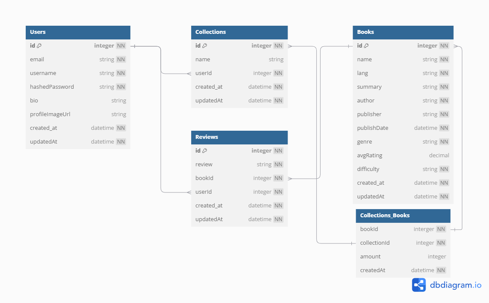

# **Database Schema**

## `users`

| column name     | data type | details               |
| --------------- | --------- | --------------------- |
| id              | integer   | not null, primary key |
| email           | string    | not null, unique      |
| username        | string    | not null, unique      |
| hashedPassword  | string    | not null, unique      |
| bio             | string    |                       |
| profileImageUrl | string    |                       |
| createdAt       | datetime  | not null              |
| updatedAt       | datetime  | not null              |

## `books`

| column name | data type | details               |
| ----------- | --------- | --------------------- |
| id          | integer   | not null, primary key |
| name        | string    | not null              |
| lang        | string    | not null              |
| summary     | string    | not null              |
| author      | string    | not null              |
| genre       | string    | not null              |
| avgRating   | decimal   |                       |
| createdAt   | datetime  | not null              |
| updatedAt   | datetime  | not null              |

## `collections`

| column name | data type | details               |
| ----------- | --------- | --------------------- |
| id          | integer   | not null, primary key |
| name        | string    |                       |
| userId      | integer   | not null, foreign key |
| lang        | string    | not null              |
| createdAt   | datetime  | not null              |
| updatedAt   | datetime  | not null              |

- `userId` references `users` table

## `collections_books` JOIN TABLE

| column name | data type | details               |
| ----------- | --------- | --------------------- |
| bookId      | integer   | not null, foreign key |
| collectionId| integer   | not null, foreign key |
| amount      | integer   |                       |
| createdAt   | datetime  | not null              |

- `bookId` references `books` table
- `collectionId` references `collections` table

## `reviews`

| column name | data type | details               |
| ----------- | --------- | --------------------- |
| id          | integer   | not null, primary key |
| review      | string    | not null              |
| bookId      | integer   | not null, foreign key |
| userId      | integer   | not null, foreign key |
| createdAt   | datetime  | not null              |
| updatedAt   | datetime  | not null              |

- `userId` references `users` table
- `bookId` references `books` table
